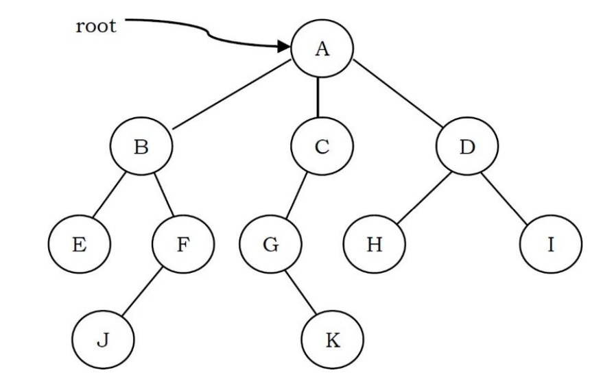
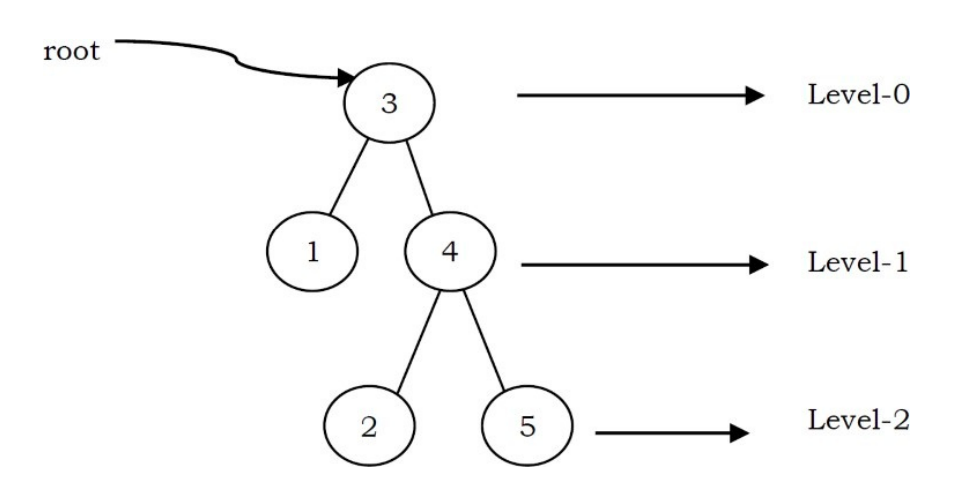

# TREE

1) the order of elements is not important
2) instead of each node pointing to simply to the next node in a linear fashion , each node points to a number of nodes

* the node of a tree is the node with no parents. 
* an edge refers to the link from parent to child (all links in the figure)
* a node with no children is called leaf node (E, J, K, H, I)
* children of the same parent called siblings (B, C, D are siblings of A, and E, F are the siblings of B)
* a node p is an acestor of node q if there exists a path from root to q and p appears on the path. The node q is called a descentdant (A, C, G are the ancestor of F)
* the set of all nodes at a give depth is called the level of the tree (B, C, D are the same level). The root node is at level zero

* the depth of a node is the length of the path from the root to the node (depth of G is 2, A - C - G)
* the height of node is the length of the path from that node to the deepest node. The heihg of a tree is the length of the path from the root to the deepest node in the tree. A (rooted) tree with only one node (the root) has a height of zero. In the previous example, the height of B is 2 (B - F - J)
* height of the tree is the maximum height among all the nodes in the tree and depth of the tree is the maximum depth among all the nodes in the tree. For a given tree, depth and height returns the same value. But for individual nodes we may get different result
* the size of node a node is the number of descendants it has including itself (the size of the subtree C is 3)
* if every node in a tree has only one child (exept lead nodes) the we call such trees skew trees. If every node has only left child the we call them left skew trees. Simalary, if every node has only right child then we callthem right skew trees

# BINARY TREES

a tree called binary tree if each node has zero child, one childor two children. Empty tree is also a valid binary tree. We can visualize a binary tree as consisting of  a root and two disjoint binary tree, called the left and right subtree of the root

## type of binary tree

**strict binary tree* : a binary tree is called strict binary tree if each node has exactly two childen or no children

